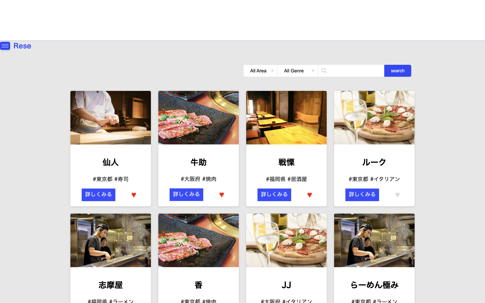
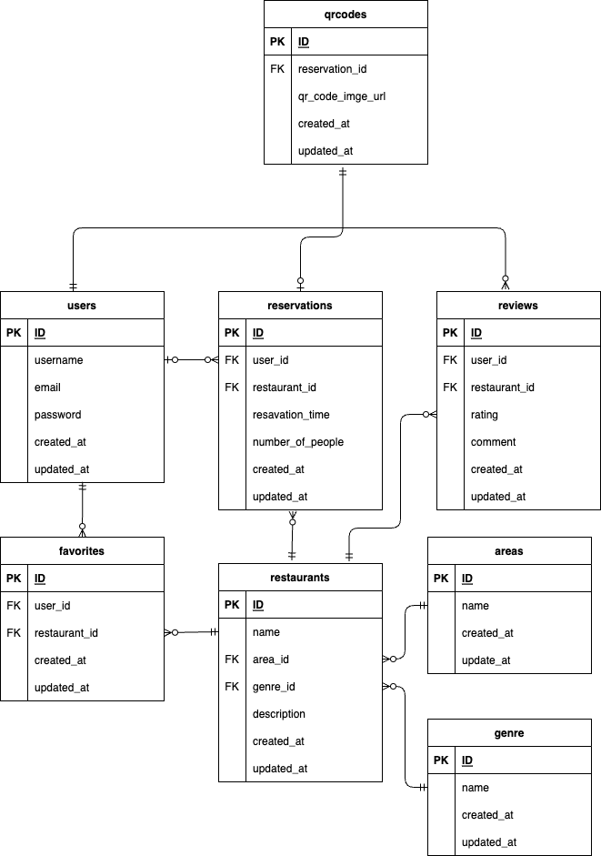

# Rese
ある企業のグループ会社の飲食店予約サービス

## 作成した目的
自社の予約サービスを作ることで、外部サービスを利用する際のコストを抑えるため

## アプリケーションURL
デプロイのURL
ログインなどあれば注意事項など

## 他のリポジトリ

## 機能一覧
- ユーザー認証（会員登録・ログイン・ログアウト）
- 飲食店情報取得（飲食店一覧・詳細）
- 飲食店検索（店名・エリア・ジャンル）
- お気に入り（追加・削除）
- 予約（追加・削除・変更）
- ユーザー情報取得（お気に入り一覧・予約一覧）
- 評価(５段階評価・レビュー)
- メール（認証・リマインダー）
- 管理者（店舗代表者作成・一覧取得）
- 店舗代表者（店舗情報編集・予約一覧取得）

## 使用技術（実行環境）
- PHP
- Laravel
- MySQL
- Laravel Fortify

## テーブル設計

## ER図

##　環境構築

**Dockerビルド**
- git clone https://github.com/tsugumi-shibata/rese
- docker-compose up -d build

**Laravel**
- docker-compose exec php bash
- composer install
- php artisan key:generate

## その他
